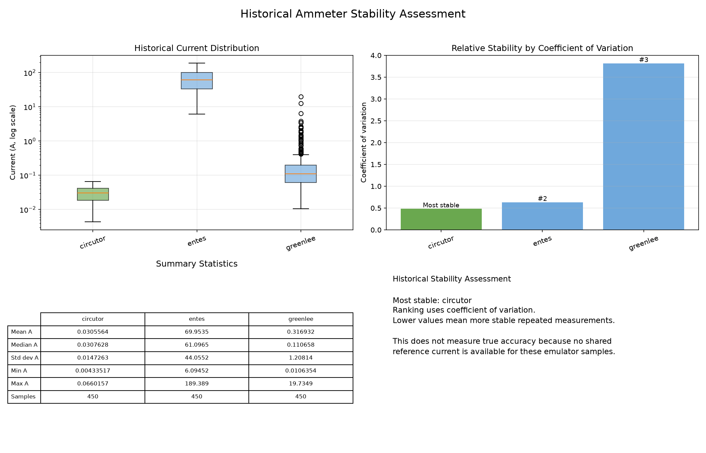

# Ammeter Test Framework



This project is a Python-based testing framework for simulated current measurement devices. It was built for an embedded systems QA exercise and demonstrates a unified way to start multiple ammeter emulators, collect timed current samples, analyze the results, and archive each run for later comparison.

Built with `Python 3.12.10`

## Table of Contents

- [Overview and Application Flow](#overview-and-application-flow)
- [Framework Capabilities](#framework-capabilities)
  - [Unified Ammeter Interface](#unified-ammeter-interface)
  - [Configurable Sampling](#configurable-sampling)
  - [Configuration-Driven Design](#configuration-driven-design)
  - [Analysis and Ammeter Comparison](#analysis-and-ammeter-comparison)
  - [Result Archiving and Analytics](#result-archiving-and-analytics)
  - [Error Handling](#error-handling)
- [Project Structure](#project-structure)
- [Setup and Usage](#setup-and-usage)
- [Design Decisions](#design-decisions)

## Overview and Application Flow

The assignment asks for a comprehensive test framework for multiple current measurement systems. This implementation starts simulated ammeter devices, samples each device through the same socket-based client interface, analyzes the collected current values, and archives every run so results can be inspected or compared later.

### Main components:

- [main.py](main.py): Entry point that runs the full test flow.
- [config.yaml](config/config.yaml): Runtime control file for sampling settings, ammeter registration, commands, ports, and output location.
- [test_framework.py](src/testing/test_framework.py): Orchestrator that loads configuration, starts emulators, collects measurements, analyzes data, and triggers result writing.
- [utils/](src/utils/): Supporting utilities for configuration loading, logging, run archival, plotting, and historical accuracy assessment.

### Application flow:

1. [main.py](main.py) creates an `AmmeterTestFramework` using [config.yaml](config/config.yaml).
2. The framework dynamically loads and validates the configured ammeter definitions and starts each emulator in a separate daemon thread.
3. A sampling plan is calculated from the configured duration and frequency.
4. During each sample cycle, the framework queries all configured ammeters through the unified socket client.
5. Measurements are stored with timing, status, error information, and current value, then collected into a pandas DataFrame.
6. The analysis step calculates per-ammeter statistics and stability metrics.
7. The result utilities save CSV, JSON, plots, logs, and refreshed historical analytics under [results/](results/).

## Framework Capabilities

### Unified Ammeter Interface

Each ammeter has different internal measurement logic, but the framework talks to all of them through the same request path.

### Configuration-Driven Design

The framework is driven by [config/config.yaml](config/config.yaml). The configuration defines:

- Sampling behavior:
  - `total_duration_seconds`: Total time to collect samples.
  - `sampling_frequency_hz`: Number of sample cycles per second.
  - `measurements_count`: Optional configuration field retained in the schema. The current sampler derives the actual sample count from duration and frequency.
- Ammeter registration:
  - `class`: Logical ammeter name.
  - `module`: Python module path: The import path Python uses to dynamically load the ammeter implementation, for example `Ammeters.Greenlee_Ammeter`.
  - `class`: Emulator class name.
  - `port`
  - `command`
- Result management:
  - `output_dir`

Because the framework dynamically imports the configured module and class, the core test runner does not need to know about each ammeter in advance. This keeps the test framework reusable and makes the supported device list easy to extend.

#### To add a new ammeter emulator simply:

1. Create a new emulator class under [Ammeters/](Ammeters/).
2. Inherit from `AmmeterEmulatorBase`, and implement `get_current_command` and `measure_current`.
3. Add the ammeter to [config.yaml](config/config.yaml) with a unique name, module, class, port, and command.

Example:

```yaml
ammeters:
  new_meter:
    class: NewMeterAmmeter
    module: Ammeters.NewMeter_Ammeter
    port: 5003
    command: "MEASURE_NEW_METER -get_measurement"
```

After that, [main.py](main.py) can run the new ammeter together with the existing devices **without changing any code**.

### Analysis and Ammeter Comparison

The analysis step calculates mean, median, standard deviation, minimum, maximum, failed sample count, and coefficient of variation for each ammeter.

The framework compares ammeters by looking at repeated-measurement stability. It uses standard deviation and coefficient of variation to show which ammeter produces the most consistent readings across a run and across historical runs. Lower coefficient of variation means the readings vary less relative to that ammeter's mean current.

This is a relative stability comparison, not a true absolute accuracy ranking, because the emulator setup does not provide a shared reference current to compare against.

### Result Archiving and Analytics

Each execution creates a unique run directory under [results/samples/](results/samples/):

```text
results/samples/<run_id>/
```

That directory contains:

- [metadata.json](results/samples/588b1dec-e8d4-42c0-847e-39fb709e06e1/metadata.json): Run ID, UTC timestamps, run status, sampling configuration, ammeter configuration, total samples, valid samples, failed samples, and artifact paths.
- [greenlee/greenlee_samples.csv](results/samples/588b1dec-e8d4-42c0-847e-39fb709e06e1/greenlee/greenlee_samples.csv): Raw sample data for each ammeter. Other ammeters get the same file pattern.
- [greenlee/time_series.png](results/samples/588b1dec-e8d4-42c0-847e-39fb709e06e1/greenlee/time_series.png): Per-ammeter plot of current measurements over time. Other ammeters get the same file pattern.
- [analytics/analytics.csv](results/samples/588b1dec-e8d4-42c0-847e-39fb709e06e1/analytics/analytics.csv): Per-run statistics for each ammeter.
- [analytics/time_series.png](results/samples/588b1dec-e8d4-42c0-847e-39fb709e06e1/analytics/time_series.png): Combined time-series plot for all configured ammeters.

The per-run analytics include:

- Valid sample count.
- Failed sample count.
- Mean current.
- Median current.
- Standard deviation.
- Minimum current.
- Maximum current.
- Coefficient of variation.

The project also maintains historical analytics in [results/analytics/](results/analytics/):

```text
results/analytics/
```

This folder contains:

- [accuracy_assessment_analytics.csv](results/analytics/accuracy_assessment_analytics.csv): Historical statistics across all saved runs.
- [accuracy_assessment_dashboard.png](results/analytics/accuracy_assessment_dashboard.png): Visual dashboard comparing historical current distribution and relative stability.

Logs are written to [results/logs/](results/logs/):

```text
results/logs/
```

### Error Handling

If an ammeter fails to return a sample, the framework records that measurement with `status="error"`, stores the exception text in the `error` column, and leaves `current_a` empty. The run continues collecting samples from the other configured ammeters instead of stopping the whole test.

Failed samples are included in each ammeter's CSV output, counted in the per-run analytics, and summarized in [metadata.json](results/samples/588b1dec-e8d4-42c0-847e-39fb709e06e1/metadata.json). If any sample fails, the run metadata status is saved as `completed_with_errors`.

## Project Structure

```text
Test_QA_expanded/
├── Ammeters/                      : Original assignment material.
├── config/
│   └── config.yaml
├── Exam/                          : Original assignment material.
├── examples/                      : Original assignment material.
├── results/                       : Generated output from framework executions.
│   ├── analytics/                 : Compare measurements across different ammeter types 
│   ├── logs/                      
│   └── samples/
├── src/                           
│   ├── testing/                   
│   │   └── test_framework.py
│   └── utils/                     : Supporting utilities for configuration, logging, output, and analytics.
│       ├── accuracy_assessment.py : Builds historical stability analytics across different ammeter types.
│       ├── config.py              
│       ├── test_results.py
│       └── Utils.py        
├── main.py                        : Main entry point for running the complete test flow.
├── requirements.txt
└── README.md 
```

## Setup and Usage

From Windows CMD, create and activate a virtual environment, then install dependencies from [requirements.txt](requirements.txt):

> On macOS or Linux, use `source .venv/bin/activate` instead of the Windows activation command.

```powershell
cd Test_QA_expanded
python venv .venv
.\.venv\Scripts\Activate.bat
pip install -r requirements.txt
```

Run the full framework:

```powershell
python main.py
```

## Design Decisions

- Configuration-driven architecture: Sampling behavior, emulator registration, commands, ports, and output location are controlled from YAML to reduce code changes.
- Dynamic imports: The framework loads ammeter classes from configuration, making new emulators easy to register.
- Unified socket client: All ammeters are queried through the same request path, even though their internal measurement logic differs.
- Threaded emulators: Each emulator runs in its own thread to simulate multiple devices being available at the same time.
- DataFrame-based analysis: pandas provides clear grouping, statistics, CSV export, and future analysis flexibility.
- Run archival with UUIDs: Every run is stored separately, making results reproducible, inspectable, and comparable over time.
- Historical analytics: Saved sample files are reused to compare stability across all previous runs.
- Minimal focused dependencies: External packages are limited to configuration loading, data handling, numerical work, and plotting.
